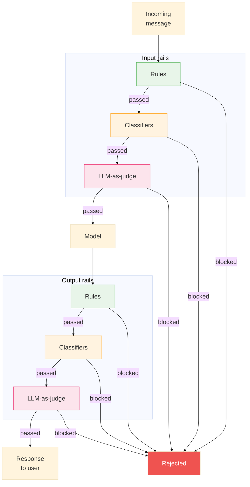

> In this blog post, we will explore the results of running the Automated Red Teaming (ART) pipeline on a baseline LLM and discuss how to use these results to develop risk mitigation strategies. We will also evaluate the effectiveness of these strategies in reducing the model's vulnerability to adversarial attacks.

## Introduction
In [the previous part]((https://blog.trustyai.org/blog/engineering/automated-red-teaming/)) of this blog post series, we introduced the Automated Red Teaming (ART) pipeline to highlight specific vulnerabilities of LLMs and showed that even a relatively straightforward adversarial attack strategy such as system prompt override can be used to effectively target LLMs. In this blog post, we will use the findings from running the ART pipeline to develop risk mitigation strategies and quantify their effectiveness.  

## Baseline scan analysis

<figure>
	<iframe
		src="/scan.intents.html"
		title="Automated red teaming scan report"
		width="100%"
		height="900"
		style="border: 0; display: block;"
	></iframe>
	<figcaption>Figure 1: Automated red teaming baseline scan report</figcaption>
</figure>

A baseline scan (see Figure 1 above) produced for the [ibm-granite/granite-3.1-2b-instruct](https://huggingface.co/ibm-granite/granite-3.1-2b-instruct) model indicated the following:

- the model's strongest built-in defense seems to be against violence, as only 20% of attacks succeeded: direct prompts, SPO, user augmentation, translation, and TAP all scored 0% against this risk category
- the model is highly vulnerable to illegal activity (100%), misinformation (100%), fraud (90%), hate speech (90%), and sexually explicit (90%) intent attacks; these risk categories were largely cracked before the pipeline even reached advanced attack strategies
- the model started cracking at the very first attack strategy: direct prompts, which succeeded at 70% for sexually explicit, 60% for illegal activity and misinformation, 50% for fraud, 40% for hate speech, 30% for security/malware and self-harm intents respectively; this could indicate that the model's safety alignment for these risk categories is shallower than for other risk categories
- Chinese translation was not an effective attackl strategy as it scored 0% across all categories except self-harm (40%). 

## Potential risk mitigation strategies
Based on the results from the aforementioned scan, it is feasible to conclude that the baseline LLM can be vulnerable to adversarial attacks across several risk categories. This knowledge is very useful as it can be used to develop risk mitigation strategies that defend against these vulnerabilities. The current landscape of risk mitigation strategies is constanly evolving, but it can be broadly categorised into the following methods: 

- alignment: adopt fine-tuning and prompt engineering techniques to make pre-trained base models less likely to produce unwanted content
- glassbox: extract LLM's internal representations and use them to predict if the output is safe or not
- runtime guardrails: apply various techniques around the LLM (without tapping into model internals) to filter out unwanted content at input and / or output 

Pragmatically, in most deployment scenarios, it is not practical or possible to make changes to model weights or even look inside the model, which completely rules out the first two risk mitigation strategies. Thus, the focus of this blog post will be on runtime guardrails as it seems to be the most viable risk mitigation strategy. 

## Runtime guardrails

Figure 2 shows a high-level architecture of runtime guardrails within the context of an LLM application. The guardrails are applied at the input and output of the LLM, and they can be implemented using a variety of techniques.

<figure>
	
	<figcaption>Figure 2: Runtime guardrails applied at the input and output of an LLM application.</figcaption>
</figure>

### The technique spectrum 

All guardrails techniques have different strengths and weaknesses, which are outlined in Table 1.

**Table 1: Comparison of runtime guardrail techniques**

| Technique | What | Cost | Accuracy |
|---|---|---|---|
| Rules | Regex, keyword lists, entity detection | Near zero | Exact for known patterns, brittle for nuance |
| Classifiers | Lightweight ML models for specific risks | Low | Good for trained risks, needs data |
| LLM-as-judge | LLM evaluates content against natural-language policy | High | Flexible, handles novel policies, but can be "subjective" |

In practice, no single technique covers all risks and layering all three techniques to create a “defense in depth” stack of guardrails as visualised in Figure 3 is recommended.

**Figure 3: Defense-in-depth runtime guardrails for processing LLM input and output.**

### NeMo Guardrails

[NeMo Guardrails](https://github.com/NVIDIA/NeMo-Guardrails) is an open source toolkit by NVIDIA for adding programmable runtime guardrails to LLM applications. It is also a recommended way to configure runtime guardrails on the Red Hat Openshift 3.4 and later. For more information, see [the official documentation](https://docs.redhat.com/en/documentation/red_hat_openshift_ai_self-managed/3.4/html/enabling_ai_safety_with_guardrails/enabling-ai-safety-with-nemo-guardrails_nemo-guardrails).

Briefly, NeMo ships with a catalogue of pre-built rails, which can be activated in `config.yml`. Some available rails are listed in Table 2

**Table 2: Available guardrails in NeMo Guardrails**

| Library rail | Technique | What it does |
|---|---|---|
| `regex` | Rules | Pattern matching — block or redact based on regular expressions |
| `sensitive_data_detection` | Rules | Presidio-powered PII detection — emails, phone numbers, credit cards, etc. |
| `jailbreak_detection` | Heuristic | Perplexity-based heuristics to catch adversarial prompt manipulation |
| `hf_classifier` | Classifier | Run any HuggingFace classifier model as a rail (toxicity, sentiment, etc.) |
| `self_check` | LLM-as-judge | Prompt an LLM to evaluate input/output against your policy |

## Guardrailed LLM scan analysis and next steps

<figure>
	<iframe
		src="/guarded_scan.intents.html"
		title="Automated red teaming scan report"
		width="100%"
		height="900"
		style="border: 0; display: block;"
	></iframe>
	<figcaption>Figure 4: Automated red teaming: LLM + HAP detector </figcaption>
</figure>

A scan (see Figure 4 above) for a LLM together with a single detector aimed at detecting hateful and profane speech ([ibm-granite/granite-guardian-hap-38m](https://huggingface.co/ibm-granite/granite-guardian-hap-38m)) resulted in a 20 % reduction in the attack success rate for the hate speech risk category, from 90% to 70%. This indicates that even a single lightweight guardrail can have an impact on the model's safety performance. We also expect that deployment of a larger detector, such as [ibm-granite/granite-guardian-hap-125m](https://huggingface.co/ibm-granite/granite-guardian-hap-125m) would result in a further reduction in the attack success rate for the hate speech risk category; we will put this to the test in the next part of this blog post series. Moreover, we will showcase how to combine multiple guardrails and evaluate effectiveness of different guardrail configurations using the developed ART pipeline.  

## Appendix

To run the demo on your cluster, you can follow the instructions in written [here](https://github.com/m-misiura/demos/blob/main/automated-red-teaming/README.md)